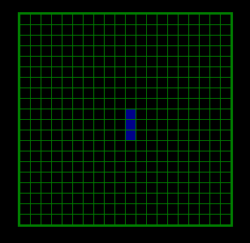
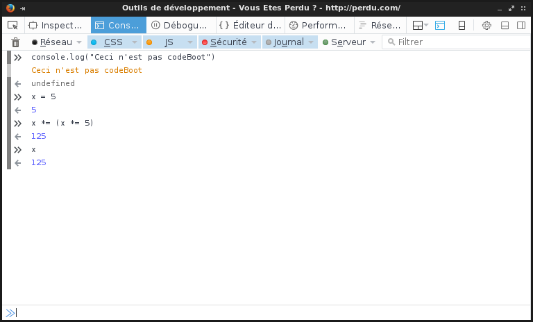

# IFT1015 - TP1 - Conway's Game of Life

------------------------------------------------------------------

## Introduction

### Présentation du TP

Dans ce premier projet vous aurez l'occasion de pratiquer les concepts
suivants:

* Les boucles
* Les tableaux multi-dimentionnels
* Les fonctions et la décomposition fonctionnelle

Vous devrez écrire une implantation d'un jeu exécuté dans une page web. Par conséquent, vous allez sortir de codeBoot et explorer un nouvel environnement de développement.

Nous vous fournissons une petite librairie qui aidera à gérer l'interface graphique ainsi qu'un gabarit écrit en Javascript qui vous servira de point de départ pour votre projet. Vous pouvez utiliser le code qui a été montré dans le cours mais vous ne pouvez pas utiliser du code provenant d'ailleurs (du web).

### Présentation du jeu

Comme le décrit si bien Wikipédia :

> Conway's Game of Life (ou le jeu de la vie) est un automate cellulaire imaginé par John Horton Conway en 1970 qui est probablement, au début du xxie siècle, le plus connu de tous les automates cellulaires.
>
> Malgré des règles très simples, le jeu de la vie est Turing-complet.

Le *Game of Life* est un jeu dit à "0 joueur", au sens où le déroulement du jeu dépend seulement de sa configuration initiale.

On dispose d'une grille de cellules qui peuvent être soit vivantes soit mortes et dont l'état change au fil du temps suivant des règles prédéfinies.

La partie se déroule donc ainsi :

1. Décider (ou laisser au hasard) quelles cellules commencent vivantes et quelles commencent mortes
2. Démarrer le jeu et laisser la grille changer d'état toute seule
3. Apprécier les jolis motifs de l'automate qui évoluent sur l'écran.

## Déroulement du jeu

Une cellule est dite vivante lorsqu'elle est colorée. À chaque "tour", chaque cellule change d'état en fonction de ses voisins :

* Une cellule qui a moins de deux voisins vivants à une étape sera morte à la prochaine étape (*sous-population*)
* Une cellule qui a deux ou trois voisins vivants continura de vivre à la prochaine étape
* Une cellule qui a plus de trois voisins vivants sera morte à la prochaine étape (*sur-population*)
* Une cellule morte qui a exactement trois voisins vivants "naîtra" à l'étape suivante et sera donc vivante (*reproduction*)

Pour avoir une idée plus concrète de ce dont une partie a l'air, vous pouvez consulter cet [exemple de partie](http://www-etud.iro.umontreal.ca/~hurtubin/ift1015-a16/jeu.gif).

### Interface

{width=60%}

La partie HTML qui décrit la grille et les boutons de l'interface est gérée pour vous, il vous reste à implanter le code qui sera appelé lorsqu'on clique sur chaque bouton.

* *Play* : Anime la grille. Ce bouton fait l'équivalent d'appuyer rapidement sur le bouton *Step*
* *Step* : Avance d'un tour dans le jeu. Chaque cellule de la grille va alors passer à son prochain état selon les règles mentionnées plus haut
* *Reset : Remet la grille à zéro (toutes les cellules tombent à l'état *mort*)
* *Random* : remplit la grille avec une densité aléatoire d'un certain pourcentage. On peut choisir le pourcentage approximatif de cellules vivantes en entrant un chiffre entre 1 et 99 dans la zone de texte à côté.
* Les deux zones de texte sous la ligne de boutons permettent de changer les dimensions de la grille **sans perdre l'état des cellules qui ne sont pas supprimées**. [Voir l'animation ici](http://www-etud.iro.umontreal.ca/~hurtubin/ift1015-a16/resize.gif).

### Exemples

Voici quelques exemples de figures que vous devriez retrouver si votre code fonctionne bien :

#### Le *glider* (planeur)

{ width=25% }
{ width=25% }
{ width=25% }
{ width=25% }

{ width=25% }
{ width=25% }
{ width=25% }
{ width=25% }

#### L'oscillateur simple

{ width=33.3% }
{ width=33.3% }
{ width=33.3% }

#### Les *still life* (structures qui ne changent pas)

{ width=30% }
{ width=30% }

## Détails techniques

### Premiers pas hors de codeBoot

Puisque le travail pratique demandera d'écrire du code qui sera lié à une page HTML donnée, vous ne pourrez plus écrire et exécuter votre code dans codeBoot.

Vous devrez écrire votre code dans un fichier (il vous faudra donc un éditeur de texte - voir les choix plus bas) et exécuter votre code dans un navigateur.

Pour lier votre code à la page HTML :

1. téléchargez le fichier `game-of-life.zip` sur StudiUM et décompressez-le quelque part.
2. Ouvrez le fichier `index.html` dans Firefox ou Chromium
3. Vous pourrez ensuite modifier le fichier `tp1.js` qui contient le squelette de l'application. Les fonctions à coder seront appelées automatiquement lorsqu'on clique sur les différents boutons.

*Notez* : vous devrez remettre *uniquement le fichier `tp1.js`*. Vous ne pouvez pas modifier les autres fichiers pour programmer le jeu.

#### Choix de l'éditeur de texte :

**Sur les ordinateurs du lab (et sur GNU/Linux en général)** :

Ouvrez `Kate` ou `gedit` depuis le menu en bas à gauche. Vous devriez comprendre assez intuitivement comment modifier un fichier Javascript, leurs interfaces sont très intuitives.

**Chez vous (assumant Windows ou Mac)** :

* Windows : Téléchargez [`Notepad++`](https://notepad-plus-plus.org/)
* Mac : Téléchargez [`TextMate`](http://macromates.com/)

**Utilisateurs avancés** :

Si vous souhaitez aller plus loin, vous voudrez possiblement tester l'un des deux éditeurs de texte mythiques pour programmeurs :

* `Emacs`~~, sans l'ombre d'un doute le seul vrai éditeur de texte pour programmeurs,~~[^1] est définitivement à essayer. Emacs est à la fois un éditeur de texte et un environnement programmable en *Elisp*, ce qui permet de modifier et d'étendre ses fonctionnalités à l'infini. C'est bien souvent le choix des programmeurs avancés qui désirent être aussi efficaces que possible.
* `vim` : l'éditeur de texte en console installé par défaut sur la majorité des ordinateurs et serveurs sous GNU/Linux, également très utilisé par les programmeurs avancés. Plusieurs plugins sont disponibles pour cet éditeur et on peut même (avec assez de motivation) écrire ses propres plugins en *VimScript*.

Un certain apprentissage est requis pour s'habituer aux deux éditeurs de texte, mais l'effort investi au début est *très payant*. Vous pouvez consulter des tutoriels : [Tour guidé d'Emacs](https://www.gnu.org/software/emacs/tour/), [Tutoriel interactif pour vim](http://www.openvim.com/tutorial.html).

Ces deux logiciels étant des logiciels libres, certaines variantes (plus jolies et avec de la configuration par défaut plus intuitive) existent :

* [Spacemacs](http://spacemacs.org/)
* [NeoVim](https://neovim.io/)

### Débugger le code

  Puisque le TP sera à réaliser dans un navigateur plutôt que dans codeBoot, vous n'aurez plus accès aux mêmes outils. Vous aurez cependant accès à des outils de développement et de débuggage similaires : les navigateurs modernes ont généralement une console dans laquelle on peut entrer du Javascript à exécuter.

  * Sous `Firefox` : tapez `Ctrl+Shift+k` pour ouvrir la console.
  * Sous `Chrome/Chromium` : tapez `Ctrl+Shift+k` pour ouvrir la console.

  Dans les deux cas, assurez-vous d'avoir l'onglet "Console" sélectionné.

*Note* : sur Mac, remplacez `Ctrl` par `Cmd` et tout devrait bien aller.

Contrairement à codeBoot, la fonction `print`[^2] pour afficher du texte n'existe pas. On utilise plutôt la fonction `console.log(...)` qui affiche des messages dans la console de développement.

{width=50%}
{width=50%}

### Implantation

#### Explication de l'API

* `Grid.create(rows, cols)` => Crée une grille de 'rows' lignes et 'cols' colonnes et
  la dessine sur la page

  Vous pouvez ouvrir la page `index.html` sur votre fureteur et exécuter la fonction `Grid.create(10, 10)`. Comme ceci:

  {width=25%}

  Ce qui deverai vous donner le resultat suivant:

  {width=25%}

* `Grid.colorCell(x, y, color)` => Remplit la cellule qui ce trouve sur la ligne x et
  la colonne y avec la couleur color

  Par exemple, si on exécute `Grid.colorCell(3, 6, '#00008B')` ou `Grid.colorCell(3, 6, 'dark blue')` (dark blue correspond au code hexadecimal #00008B) on deverait obtenire la
  grille montrée dans la figure 4

  {width=25%}

#### Fonction à coder

* `changeState(x, y)`: cette fonction sera utilisée par votre code interne, elle servira à changer l'état de la cellule `(x,y)` (mort ou vivante).

* `step()`: est exécuté à chaque pas de l'évolution du jeu lorsqu'on on clique sur le bouton `Play` ou `Step` si on veut observer l'évolution du jeu étape par étape.

* `randomGrid(percent)` : remplit la grille avec une densité aléatoire d'un certain pourcentage. Pour cela, la fonction `randomGrid` est appellée par le boutton `Random` avec en paramètre le pourcentage (0 à 99) entré dans la zone de texte juste à côté.

* `resetGrid()`: cette fonction devrait vider la grille de toutes les cellules vivantes. On devrait donc voire une grille vide sur la page après avoir exécuté cette fonction.

* `resizeGrid(width, height)`: sert à redimensionner la grille. La fonction est appelée à chaque fois qu'on modifie les valeurs de longueur et largeur sur l'interface:

 {width=25%}

#### Comportement de la grille

De façon générale, en informatique, on considère que le pixel situé en haut à gauche est le pixel (0, 0). L'axe X va vers la droite (comme ce à quoi vous devriez être habitués) et l'axe Y est dirigé vers le bas.

{width=40%}

Un peu comme les *warp zones* de Pac-Man, la grille est considérée comme périodique. Autrement dit, sur une grille de 10x10, le pixel à la position (0, 5) est "voisin" de (9, 5) et le pixel (5, 0) est voisin de (5, 9) :

{width=25%}
{width=25%}
{width=25%}
{width=25%}

## Bonus : Version trois couleurs

Si vous terminez le travail plus tôt que les autres et que vous souhaitez pousser le jeu plus loin, vous êtes invités à remettre un *deuxième fichier*, **`bonus.js`** pour des points bonus.

Vous devez adapter le plus gracieusement possible votre code original pour supporter *trois grilles de Game of Life* parallèles, une représentée par le rouge, une représentée par le vert et une représentée par le bleu.

La couleur affichée à l'écran sera une combinaison de ces trois couleurs. Vous aurez donc $2^3 = 8$ états possibles :

* Noir (mort)
* Rouge (vivant dans la grille 1 seulement)
* Vert (vivant dans la grille 2 seulement)
* Jaune (vivant dans les grilles 1 et 2, mort dans la grille 3)
* Bleu (vivant dans la grille 3)
* Fuchsia (vivant dans les grilles 1 et 3)
* Turquoise (vivant dans les grilles 2 et 3)
* Blanc (vivant dans toutes les grilles)

{width=30%}

De plus :

* lorsqu'on clique sur une cellule, sa couleur doit passer à la prochaine couleur dans la liste (dans cet ordre).
* La fonction de randomisation doit attribuer une couleur aléatoire parmi les huit à chaque cellule

[Voir l'animation ici](http://www-etud.iro.umontreal.ca/~hurtubin/ift1015-a16/couleurs.gif)

## Évaluation

* Ce travail compte pour 15% dans la note finale du cours. Vous **devez** faire le travail par groupes de 2 personnes. Indiquez vos noms clairement dans les commentaires au début de votre code. Un travail fait seul engendrera une lourde pénalité (qui ne peut **pas** être compensée par la question bonus). Les équipes de plus de deux seront refusées.

* Vous devez seulement remettre votre fichier `tp1.js`. Si vous avez fait la question bonus, remettez également le fichier `bonus.js`. La remise doit se sur le site Studium du cours avant la date indiquée sur la page prévue à cet effet.

* Voici les critères d'évaluation du travail :
    * l'exactitude (respect de la spécification)
    * l'élégance et la lisibilité du code
    * la présence de commentaires explicatifs lorsque nécessaire
    * le choix des identificateurs
    * la décomposition fonctionnelle et le choix de tests unitaires pertinents

* Indications :
    * La performance de votre code doit être raisonnable.
    * Chaque fonction devrait avoir un bref commentaire pour indiquer ce qu'elle fait.
    * Il devrait y avoir des lignes blanches pour que le code ne soit pas trop dense (utilisez votre bon sens pour arriver à un code facile à lire)
    * Les identificateurs doivent être bien choisis pour être compréhensibles (évitez les noms à une lettre, à l'exception de `i`, `j`, ... pour les variables d'itérations des boucles `for`).
    * Vous devez respecter le standard de code pour ce projet (soit, les noms de variables en camelCase).
    * Il ne devrait plus y avoir de code de debug (aka, `console.log(...)`) dans la version finale remise.

[^1]: Voir [Editor war sur Wikipédia](https://en.wikipedia.org/wiki/Editor_war) pour plus de détails
[^2]: Techniquement, les navigateurs ont une fonction `print`, mais si vous l'utilisez, vous vous retrouverez à littéralement imprimer la page web...
